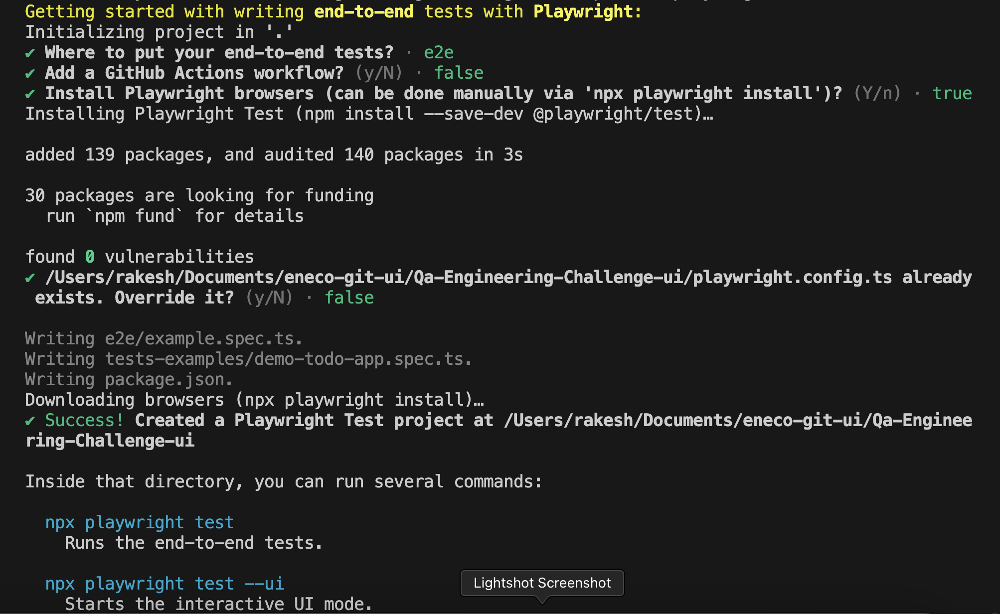
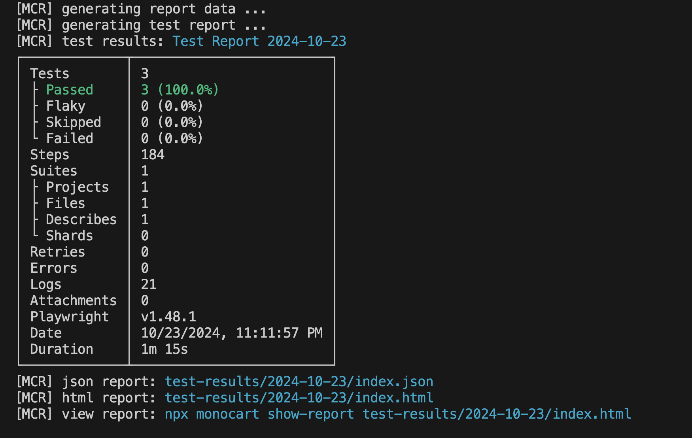

# ENECO Playwright

ENECO Playwright is a suite of automated tests designed for the ENECO application, focusing on writing and executing test cases efficiently using Playwright.

Project Mainly focuses on:

- Automating test cases of ENECO application
- Writing test suits

## Table of Contents

- [ENECO Playwright](#eneco-playwright)
  - [Table of Contents](#table-of-contents)
  - [Installation](#installation)
    - [Clone repo](#clone-repo)
  - [Playwright](#playwright)
    - [Basic usage](#basic-usage)
    - [Build](#build)
    - [Env setup](#env-setup)
  - [Project Convention](#project-convention)
  - [Documentation](#documentation)
  - [Execution Setup](#execution-setup)
  -[Logger Setup](#logger-setup)
 
## Installation

### Visual Studio Code
- **Visual Studio** [Download VS IDE](https://code.visualstudio.com/)


### Clone repo

```bash
# Clone the repo
git clone https://github.com/Ravivish1185/Qa-Engineering-Challenge-ui.git

# Install dependencies
$ npm init playwright@latest


$ npm i winston-daily-rotate-file
$ npm i monocart-reporter

# Install the browsers to run the tests with playwright
$ npx playwright install
```

## Playwright

This project was begun with [Playwright](https://playwright.dev/docs/intro)

### Basic usage

```bash
# Run test cases
 npm run test

# Run test cases in UI mode
 npm run play
```

Navigate to [http://localhost:3000](http://localhost:3000). The app will automatically reload if you change any of the source files.

### Build

Run `build` to build the project. The build artifacts will be stored in the `build/` directory.

### Env setup

Create new file `.env` based on `.env.example` file. Update values for `.env` before running the project. 
To execute in `ENECO` set ENECO_BASE_URL and credentials for eneco website in `.env`


## Project Convention

In the repo you'll find the following directories and files, logically grouping common assets and providing both compiled and minified variations. You'll see something like this:

```
ENECO_UI_AUTOMATION_PW
├── pages              # Page Object Model (POM)
├── test-data          # Test data files
├── tests              # Test suites organized by feature
│   ├── calculate-monthly-amount
└── utils              # Utility functions
```


## Documentation

- [Playwright](https://playwright.dev)

- **Typescript**
  - This consists of tsconfig.json file with configuration for the typescript compiler.

## Execution Setup 
 - All the test releated to UI are in one folder 
 - command to run the script in headless true mode `npx playwright test tests` 
 - command to run the script in headless false mode `npx playwright test tests --headed`
 - command to run the script in debug mode `npx playwright test tests --debug`
 - command to run the script in playwright ui mode `npm run play`

 ## Execution Report Summary from monocart-reporter
 
- To view monocart show-report
`npx monocart show-report test-results/2024-10-23/index.html`

 ## Logger Setup 
 - All the information related to warnings ,errors stored in `eneco-logs` folder in `eneco-ui-run.log` file 
 
